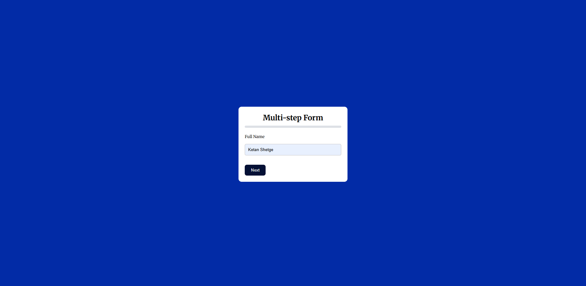
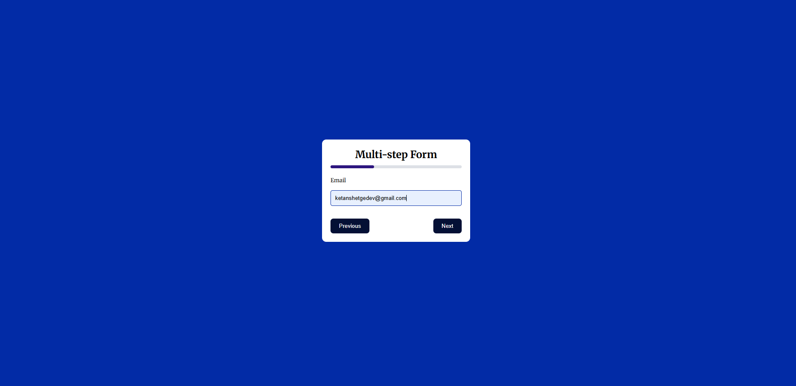
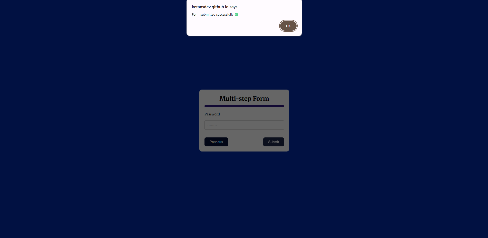

# Multi-Step Form 🚀

A Multi-Step Form built using HTML, CSS, and JavaScript that guides users through a form in multiple steps with a visual progress indicator.

This project focuses on improving user experience by breaking long forms into manageable sections while validating inputs at each step and updating progress in real time.

---

## 🔗 Live Demo  
https://ketansdev.github.io/Javascript/30%20Javascript%20Projects/project-02-multi-step-form/

---

## 🛠 Tech Stack  
- HTML  
- CSS  
- JavaScript (Vanilla JS)  
- DOM Manipulation  

---

## ✨ Features  
- Step-by-step form layout with progress bar tracking  
- Next and Previous navigation between form steps  
- Input validation before moving to the next step  
- Real-time progress update based on current step  
- Prevents submission until all required fields are completed  
- Clean, minimal, and responsive UI  
- Improves usability for long or complex forms  

---

## 📸 Screenshots  

### Step 1 – User Name

### Step 2 – Additional Details

### Final Step – Review & Submit  

