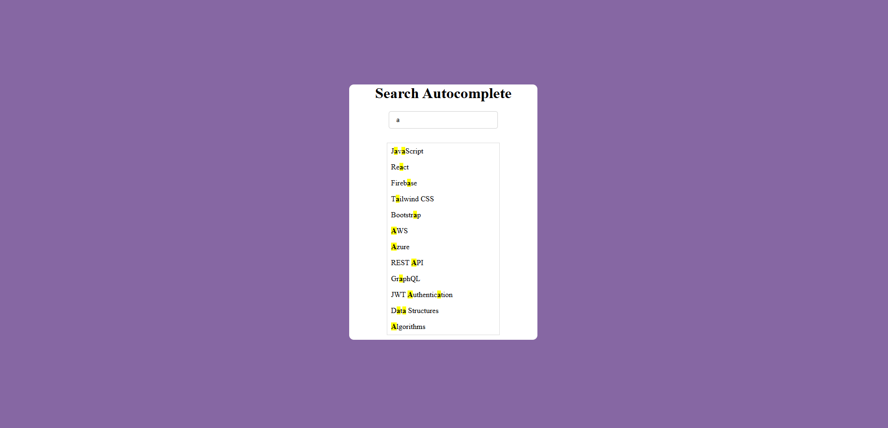

# 🔍 Search Autocomplete

## 🔗 Live Demo  
https://ketansdev.github.io/Javascript/30%20Javascript%20Projects/project-04-search-autocomplete/

---

## 📌 Overview  

A dynamic **Search Autocomplete** feature built using HTML, CSS, and JavaScript that provides real-time suggestions as users type.

As the user enters text into the search field, relevant results are instantly filtered and displayed in a dropdown list. Matching letters are highlighted for better visibility, and users can navigate suggestions using both keyboard and mouse.

This project focuses on DOM manipulation, real-time filtering logic, event handling, keyboard navigation, and UI state management.

---

## 🛠 Tech Stack  

- HTML  
- CSS  
- JavaScript (Vanilla JS)  
- DOM Manipulation  
- Regular Expressions (RegExp)  

---

## ✨ Features  

- Real-time search suggestions  
- Highlighted matching text  
- Enter key to select suggestion  
- Click-to-select support  
- Auto-hide dropdown when input is empty  
- Dynamic border handling  
- Clean & responsive UI  
- No external libraries used  

---

## 🧠 What I Learned  

- Handling input events efficiently  
- Filtering arrays dynamically  
- Managing active states in lists  
- Improving user experience with keyboard controls  
- Writing clean and reusable DOM logic  

---

## 📸 Screenshots  

### 🖥 Search Input  

### 📋 Suggestions Dropdown  

### ✨ Highlighted Match  

