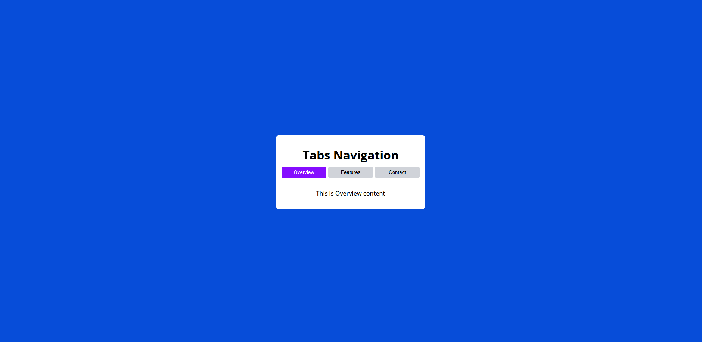

# 📑 Tabs Navigation System

## 🔗 Live Demo  
https://ketansdev.github.io/Javascript/30%20Javascript%20Projects/project-05-tabs-navigation-system/

---

## 📌 Overview  

A **Tabs Navigation System** built using HTML, CSS, and JavaScript that allows users to switch between different content sections without reloading the page.

This project demonstrates how to build an intuitive and responsive tab-based interface with clear active states and smooth content transitions using DOM manipulation.

It focuses on improving user experience, content organization, and clean UI structuring.

---

## 🛠 Tech Stack  

- HTML  
- CSS  
- JavaScript (Vanilla JS)  
- DOM Manipulation  

---

## ✨ Key Features  

- Click-based navigation between tabs  
- Dynamic content switching without page reload  
- Active tab highlighting for better UX  
- Clean and responsive layout  
- Smooth content visibility handling  
- Easy to customize and extend with additional tabs  
- Improved content organization and accessibility  

---

## 🧠 What I Learned  

- Handling click events efficiently  
- Managing active states dynamically  
- Showing and hiding content sections using JavaScript  
- Writing clean and reusable tab-switching logic  
- Improving UI structure using CSS  

---

## 📸 Screenshots  

### 🖥 Tabs Interface  

