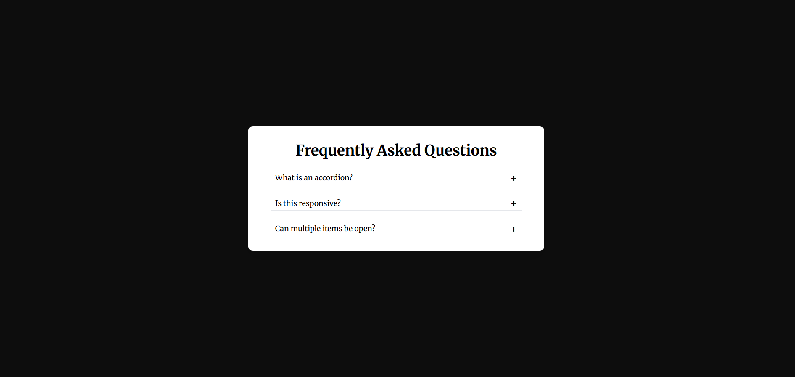

# 📂 Accordion / FAQ Section

## 🔗 Live Demo  
https://ketansdev.github.io/Javascript/30%20Javascript%20Projects/project-06-accordion/

---

## 📌 Overview  

An **Accordion / FAQ Section** built using HTML, CSS, and JavaScript that allows users to expand and collapse content sections smoothly.

This project improves content readability by showing only relevant information at a time, making it ideal for FAQs, help sections, and documentation pages.

It demonstrates how to manage active states dynamically, implement true accordion behavior (only one item open at a time)
---

## 🛠 Tech Stack  

- HTML  
- CSS  
- JavaScript (Vanilla JS)  
- DOM Manipulation  

---

## ✨ Key Features  

- Expand and collapse FAQ items with a click  
- True accordion behavior (only one item open at a time)  
- Smooth open and close animation using `max-height`  
- Dynamic class handling for active states  
- Visual indicator (+ / −) using CSS pseudo-elements  
- Clean, minimal, and responsive design  
- Easy to customize and reuse in other projects  

---

## 🧠 What I Learned  

- Handling click events and DOM selection  
- Managing active states using `classList`  
- Difference between `display` and `max-height` animations  
- Creating smooth UI transitions using CSS  
- Using `::after` pseudo-element for dynamic icons  
- Writing clean and maintainable accordion logic  

---

## 📸 Screenshots  

### 🖥 Accordion Interface  
