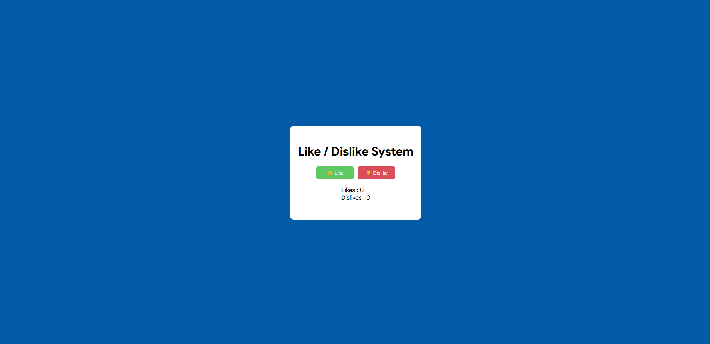

# 👍 Like / 👎 Dislike Counter System

## 🔗 Live Demo  
https://ketansdev.github.io/Javascript/30%20Javascript%20Projects/project-10-like-dislike-counter-system/

---

## 📌 Overview  

A **Like / Dislike Counter System** built using HTML, CSS, and JavaScript that allows users to react to content with a like or dislike.

The system updates reaction counts instantly and manages user interaction state to prevent multiple or conflicting actions, providing a smooth and intuitive feedback mechanism.

This project demonstrates dynamic state handling, DOM manipulation, and interactive UI logic using Vanilla JavaScript.

---

## 🛠 Tech Stack  

- HTML  
- CSS  
- JavaScript (Vanilla JS)  
- DOM Manipulation  

---

## ✨ Key Features  

- Like and Dislike buttons with real-time count updates  
- Prevents multiple selections of the same reaction  
- Automatically switches state when changing from like to dislike (and vice versa)  
- Visual indication of the active reaction  
- Clean, responsive, and user-friendly interface  
- Easily extendable for posts, comments, or API-based systems  

---

## 🧠 What I Learned  

- Managing UI state dynamically using JavaScript  
- Preventing conflicting user actions  
- Updating counts in real-time without page reload  
- Using conditional logic for reaction switching  
- Writing clean and maintainable interactive logic  
- Improving UX with visual feedback  

---

### 🖥 Reaction System Interface  
