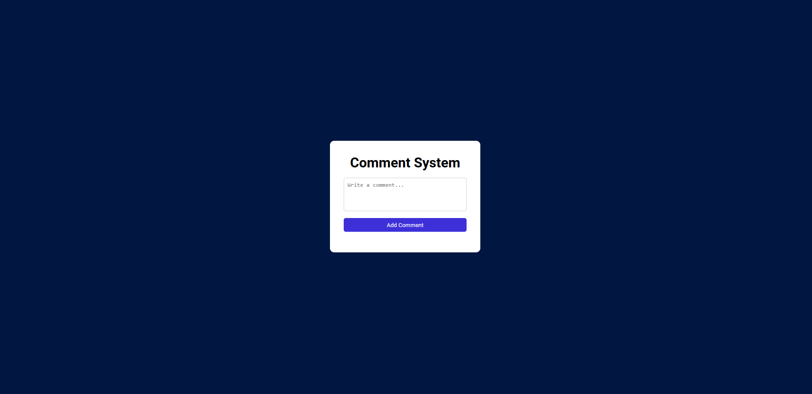

# 💬 Comment System

## 🔗 Live Demo  
https://ketansdev.github.io/Javascript/30%20Javascript%20Projects/project-11-comment-system/

---

## 📌 Overview  

A **Comment System** built using HTML, CSS, and JavaScript that allows users to manage comments in real time.

The project enables adding, editing, and deleting comments dynamically without page reloads, demonstrating interactive content handling and smooth UI updates.

It showcases how to handle user input, dynamically render content, and manage UI state using Vanilla JavaScript.

---

## 🛠 Tech Stack  

- HTML  
- CSS  
- JavaScript (Vanilla JS)  
- DOM Manipulation  

---

## ✨ Key Features  

- Add new comments instantly through user input  
- Edit existing comments with inline updates  
- Delete comments with immediate UI refresh  
- Dynamic rendering of comments in real time  
- Prevents empty comment submissions  
- Clean, responsive, and user-friendly interface  

---

## 🧠 What I Learned  

- Handling form input and validation in JavaScript  
- Dynamically creating and updating DOM elements  
- Managing edit and delete functionality for content  
- Implementing real-time UI updates without page reload  
- Writing cleaner interactive logic for user-driven actions  

---

## 📸 Screenshots  

### 🖥 Comment Interface  

