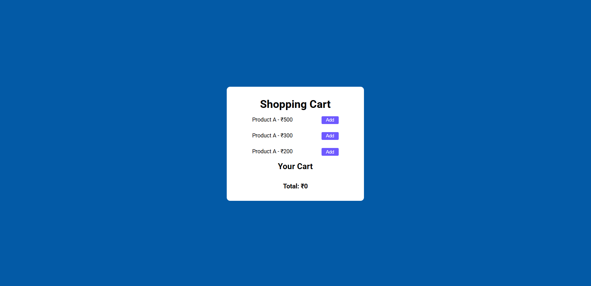

# 🛒 Shopping Cart System

## 🔗 Live Demo  
https://ketansdev.github.io/Javascript/30%20Javascript%20Projects/project-14-shopping-cart/

---

## 📌 Overview  

A **Shopping Cart System** built using HTML, CSS, and JavaScript that allows users to add and remove products while automatically calculating the total cost.

The project demonstrates real-time cart updates and basic state management commonly used in e-commerce applications.

It showcases how to dynamically manage product lists, update totals instantly, and handle user interactions using Vanilla JavaScript.

---

## 🛠 Tech Stack  

- HTML  
- CSS  
- JavaScript (Vanilla JS)  
- DOM Manipulation  

---

## ✨ Key Features  

- Add products to the cart dynamically  
- Remove items from the cart instantly  
- Real-time total price calculation  
- Clean and user-friendly interface  

---

## 🧠 What I Learned  

- Managing application state using JavaScript  
- Dynamically updating the DOM based on user actions  
- Performing real-time price calculations  
- Handling add/remove item logic efficiently  
- Creating interactive UI behavior without page reloads  

---

## 📸 Screenshots  

### 🖥 Shopping Cart Interface  
