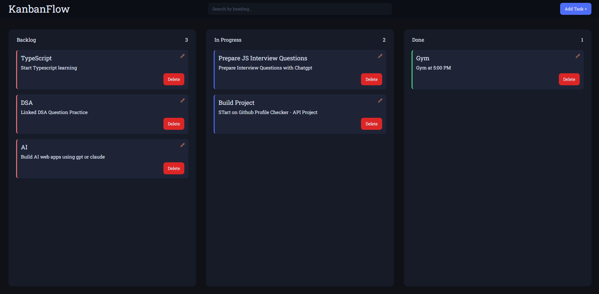
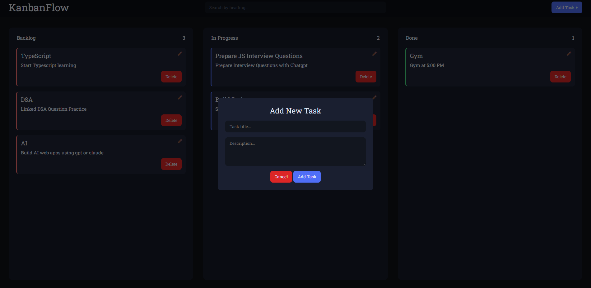
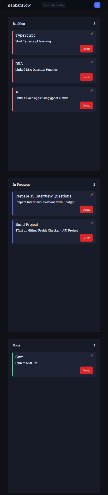

A drag-and-drop task management app built with vanilla HTML, CSS, and JavaScript.
 
🔗 **Live Demo:** [https://warm-cranachan-ded114.netlify.app](#)
 
---
 
## 📌 About The Project
 
A lightweight Kanban board that helps you organize tasks across three stages — Backlog, In Progress, and Done. Built without any frameworks or libraries, using only vanilla JS with a clean dark theme.
 
---
 
## ✨ Features
 
- **Drag & Drop** — Move tasks between columns smoothly
- **Add Task** — Create new tasks with a title and description via modal
- **Edit Task** — Update existing task details anytime
- **Delete Task** — Remove tasks with one click
- **Search Filter** — Search tasks by title, matching cards glow
- **Task Count** — Live count of tasks per column
- **Local Storage** — Tasks persist on page refresh
- **Toast Notifications** — Feedback on add, edit, and delete actions
- **Responsive Design** — Works on mobile and desktop
- **Dark Theme** — Easy on the eyes with a consistent design system
 
---
 
## 🖥️ Screenshots
 
> Replace the paths below with your actual screenshots
 
| Board View | Add Task Modal | Mobile View |
|------------|---------------|-------------|
|  |  |  |
 
---
 
## 🛠️ Built With
 
- HTML5
- CSS3 (Custom Properties / Variables)
- JavaScript (Vanilla)
- LocalStorage API
- Drag and Drop API
 
---
 
## 🚀 Getting Started
 
No installation needed — just open the file in your browser.
 
```bash
git clone https://github.com/your-username/kanban-board.git
cd kanban-board
open index.html
```
 
---
 
## 📁 Project Structure
 
```
kanban-board/
├── index.html
├── style.css
└── script.js
```
 